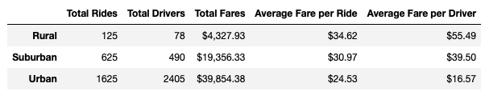
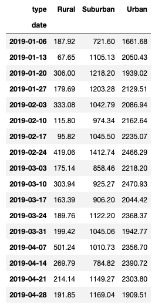
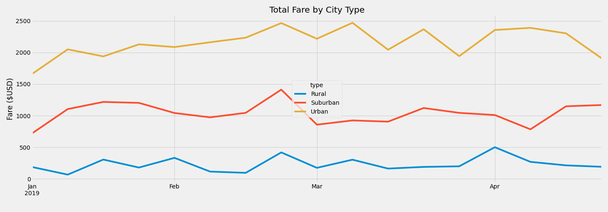

# PyBer Analysis

## Overview

### Purpose

The purpose of this analysis is to assist V. Isualize, the CEO, and Omar, the head of data, to improve access to ride-sharing services. PyBer is a Python based ride-sharing app company that serves three city types: Rural, Urban and Suburban. A summary DataFrame of the ride-sharing data by city type was generated by performing an exploratory analysis on data with Python. Additionally, a multiple-line chart was created using Matplotlib to showcase the relationship between total fares and type of city.

This analysis can be used to inform discussion and assist the CEO and management to determine affordability for underserved neighborhoods.

## Results

### Datasets and Files

The PyBer analysis is based on the following datasets: 
* City Data: [city_data](Resources/city_data.csv)
* Ride Data: [ride_data](Resources/ride_data.csv)

The PyBer analysis is available here: [PyBer_Challenge](PyBer_Challenge.ipynb)

### Software and Application

The software and web-based application used for this analysis are:

* Python 3.7.11 (using PythonData environment and Pandas Library)
* Jupyter Notebook 6.4.6
* Matplotlib 

### Outcomes 
The summary Dataframe is a high-level snapshot of PyBer's key metrics: 

- Total Rides
- Total Drivers
- Total Fares
- Average Fare per Ride
- Average Fare per Driver

As stated earlier PyBer serves three city types: Rural, Suburban and Urban. To showcase the ride-sharing data by city type the following summary DataFrame was generated:



In the summary DataFrame, the urban cities have the highest number of total rides at 1,625, total drivers at 2,405, and total amount of fares at $39,854.38. However, urban cities have the lowest average fare per ride at $24.53 and average fare per driver at $16.57. Clearly, this market is sustained by a high demand of rides and a high supply of drivers. 

As per the rural cities, it has the lowest number of total rides at 125 and total drivers at 78, although due to the low supply of drivers and the long distances between destinations it has the highest average fare per ride at $34.62 and average fare per driver at $55.49. 

The overall ride activity in Suburban cities places them in the middle of urban and rural cities, but it is important to note the demand of rides is higher than the supply of drivers, thus resulting at a higher end of average fare per ride at $30.97 and average fare per driver at $39.50.     

Furthermore, a multiple-line graph was created to show the total fares for each week by city type. Prior to the generation of this multiple-line chart, it was imperative to create a new DataFrame using the **resample() function** by week ('W') to get the sum of the fares for each week. For this, a specific date range was grouped in weeks from 2019-01-01 to 2019-04-28, resulting in 17 weeks of data.

The code block is as follows:

```
filter_daterange_df = pivot_df.loc['2019-01-01':'2019-04-28']
filter_daterange_df

weekly_range_df = filter_daterange_df.resample('W').sum()
weekly_range_df
```

The sum of the fares per city type for each week is represented in the below DataFrame: 



The highest performing week for rural was week 2019-04-07 settling them at $501.24. Surburban's highest performing week was week 2019-02-24 settling them at $1,412.74. As per Urban, its highest performing week was week 2019-03-10 settling them at $2,470.93.

This data was then plotted using the **df.plot() function**. The code block is as follows:


```
from matplotlib import style
style.use('fivethirtyeight')

weekly_range_df.plot(figsize = (20,7)).set_ylabel('Fare ($USD)')
plt.title("Total Fare by City Type")
plt.xlabel(' ')
plt.tight_layout()
plt.savefig("analysis/PyBer_fare_summary.png")
```

This multiple-line graph shows the total fares for each week by city type. Based on the legend, the blue line represents Rural, the red line represents Suburban, and the yellow line represents Urban each being a different city type.



## Summary
It is evident there is a disparity among all three city types. In order to have a more predicting ride activity in Rural, Suburban and Urban cities, here are the following business recommendations:  

1. To hire more drivers in Rural and Suburban cities perhaps with an incentive program of completing the first 50 rides in 60 days so that all ride requests are serviced.
2. More advertisements and marketing programs targeting Rural cities to generate more awareness of PyBer the ride-sharing app that can facilitate rides any time anywhere at an affordable rate.
3. Encourage users in Urban cities to book Pyber for longer ride destinations such as, to the airport, vacation spots in nearby cities and perhaps for moving purposes which are all reasons that can add to higher fares per ride and per driver.

In summary, an exploratory analysis on city and ride data was completed in order to generate a summary DataFrame of the ride-sharing data by city type. This data was then represented in a multiple-line chart so that it can be used to inform discussion and assist the CEO and management to determine affordability for underserved neighborhoods.


